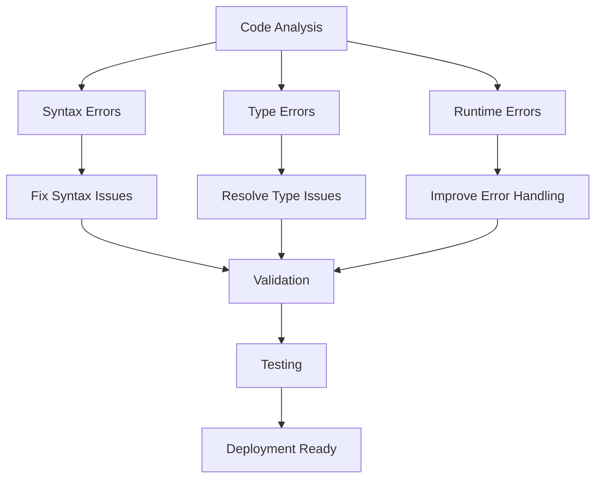
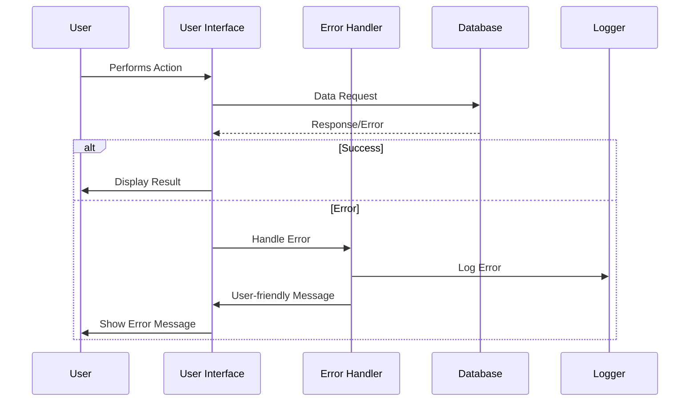

# Design Document

## Overview

Este documento describe el diseño técnico para corregir errores existentes y mejorar la estabilidad de la aplicación TiendaFácil. El enfoque será sistemático, priorizando errores críticos que afectan la funcionalidad básica, seguido de mejoras en el manejo de errores y optimizaciones de rendimiento.

## Architecture

### Error Detection and Resolution Strategy



### Component Error Handling Flow



## Components and Interfaces

### 1. Syntax Error Fixes

**Catalog Page Component**
- **Issue**: Incomplete HTML tag `<div cla` in main section
- **Solution**: Complete the className attribute and ensure proper JSX structure
- **Impact**: Critical - prevents page rendering

**TypeScript Configuration**
- **Issue**: `ignoreBuildErrors: true` masks important type errors
- **Solution**: Remove ignore flag and fix underlying type issues
- **Impact**: High - improves code quality and catches errors early

### 2. Error Handling System

**Centralized Error Handler**
```typescript
interface ErrorHandler {
  logError(error: Error, context: string): void;
  displayUserError(message: string, type: 'warning' | 'error' | 'info'): void;
  handleAsyncError(promise: Promise<any>): Promise<any>;
}
```

**Database Connection Improvements**
```typescript
interface DatabaseConnection {
  connect(): Promise<boolean>;
  handleConnectionError(error: MongoError): void;
  retryConnection(maxRetries: number): Promise<boolean>;
  getConnectionStatus(): ConnectionStatus;
}
```

### 3. User Interface Enhancements

**Loading States**
- Implement skeleton loaders for product grids
- Add loading indicators for async operations
- Provide feedback during form submissions

**Error Display Components**
- Toast notifications for temporary errors
- Modal dialogs for critical errors
- Inline validation messages for forms

## Data Models

### Error Logging Model
```typescript
interface ErrorLog {
  id: string;
  timestamp: Date;
  level: 'error' | 'warning' | 'info';
  message: string;
  stack?: string;
  context: {
    userId?: string;
    storeId?: string;
    action: string;
    component: string;
  };
  resolved: boolean;
}
```

### User Feedback Model
```typescript
interface UserFeedback {
  type: 'error' | 'success' | 'warning' | 'info';
  title: string;
  message: string;
  duration?: number;
  actions?: Array<{
    label: string;
    action: () => void;
  }>;
}
```

## Error Handling

### 1. Client-Side Error Handling

**React Error Boundaries**
- Implement error boundaries for major components
- Provide fallback UI for crashed components
- Log errors to monitoring service

**Async Operation Handling**
- Wrap all API calls in try-catch blocks
- Implement retry logic for failed requests
- Show appropriate loading and error states

### 2. Server-Side Error Handling

**API Route Error Handling**
- Standardize error response format
- Implement proper HTTP status codes
- Log server errors with context

**Database Error Handling**
- Handle connection timeouts gracefully
- Implement connection pooling
- Provide meaningful error messages

### 3. Form Validation

**Client-Side Validation**
- Real-time validation feedback
- Clear error messages
- Prevent invalid form submissions

**Server-Side Validation**
- Validate all inputs on the server
- Return structured validation errors
- Sanitize user inputs

## Testing Strategy

### 1. Error Scenario Testing

**Unit Tests**
- Test error handling functions
- Mock error conditions
- Verify error messages and logging

**Integration Tests**
- Test database connection failures
- Test API error responses
- Test form validation scenarios

### 2. User Experience Testing

**Manual Testing**
- Test all user flows with error conditions
- Verify error messages are user-friendly
- Test responsive design on various devices

**Automated Testing**
- E2E tests for critical user paths
- Performance testing under load
- Accessibility testing

### 3. Error Recovery Testing

**Connection Recovery**
- Test database reconnection
- Test network failure recovery
- Test partial data loading scenarios

**State Recovery**
- Test cart persistence after errors
- Test form data recovery
- Test user session recovery

## Implementation Phases

### Phase 1: Critical Fixes (High Priority)
1. Fix syntax errors in catalog page
2. Resolve TypeScript configuration issues
3. Fix database connection error handling
4. Implement basic error boundaries

### Phase 2: Error Handling Improvements (Medium Priority)
1. Implement centralized error logging
2. Add user-friendly error messages
3. Improve form validation
4. Add loading states

### Phase 3: Performance and UX (Low Priority)
1. Optimize image loading
2. Implement caching strategies
3. Add progressive loading
4. Enhance mobile experience

## Security Considerations

### Error Information Disclosure
- Never expose sensitive information in error messages
- Log detailed errors server-side only
- Provide generic error messages to users

### Input Validation
- Validate all user inputs
- Sanitize data before database operations
- Implement rate limiting for API endpoints

## Performance Considerations

### Error Handling Performance
- Minimize error handling overhead
- Use efficient logging mechanisms
- Implement error batching for high-frequency errors

### User Experience Performance
- Fast error message display
- Non-blocking error handling
- Graceful degradation for slow connections