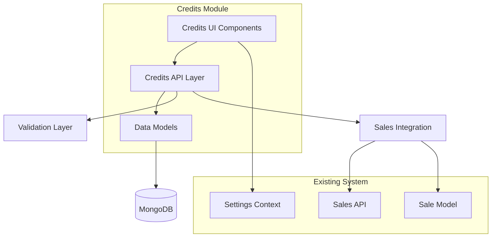

# Design Document - Módulo de Créditos y Cuentas por Cobrar

## Overview

El módulo de créditos y cuentas por cobrar se diseña como un sistema integral que extiende la funcionalidad existente de ventas para manejar transacciones a crédito. El diseño se basa en una arquitectura de APIs RESTful con modelos de datos robustos y una interfaz de usuario moderna que se integra seamlessly con el sistema POS existente.

## Architecture

### High-Level Architecture



### Data Flow

1. **Credit Sale Creation**: Sale → Account Receivable (automatic)
2. **Payment Processing**: UI → API → Account Receivable → Sale (sync)
3. **Dashboard Updates**: API → Aggregation → UI (real-time)

## Components and Interfaces

### 1. Data Models

#### AccountReceivable Model
```typescript
interface AccountReceivable {
  id: string;                    // Unique identifier
  saleId: string;               // Reference to original sale
  customerId: string;           // Customer identifier
  customerName: string;         // Customer display name
  customerPhone?: string;       // Contact information
  storeId: string;             // Store identifier
  
  // Financial data
  originalAmount: number;       // Original debt amount
  paidAmount: number;          // Total amount paid
  remainingBalance: number;    // Calculated remaining balance
  
  // Dates
  saleDate: Date;              // Original sale date
  dueDate: Date;               // Payment due date
  lastPaymentDate?: Date;      // Last payment received
  
  // Status and control
  status: AccountStatus;        // Current account status
  creditDays: number;          // Credit term in days
  payments: PaymentRecord[];   // Payment history
  
  // Audit fields
  createdBy: string;
  updatedBy?: string;
  createdAt: Date;
  updatedAt: Date;
}

enum AccountStatus {
  PENDING = 'pending',
  PARTIAL = 'partial', 
  PAID = 'paid',
  OVERDUE = 'overdue',
  CANCELLED = 'cancelled'
}
```

#### PaymentRecord Model
```typescript
interface PaymentRecord {
  id: string;
  amount: number;
  paymentMethod: string;
  reference?: string;
  type: PaymentType;
  notes?: string;
  processedBy: string;
  processedAt: Date;
}

enum PaymentType {
  PAYMENT = 'payment',
  ADJUSTMENT = 'adjustment',
  DISCOUNT = 'discount',
  REFUND = 'refund'
}
```

### 2. API Endpoints

#### Credits Management API
- **GET /api/credits** - List accounts receivable with filters
- **POST /api/credits** - Create account from credit sale
- **PUT /api/credits** - Add payment to account
- **GET /api/credits/summary** - Dashboard metrics and analytics

#### API Request/Response Schemas

```typescript
// GET /api/credits
interface GetCreditsRequest {
  storeId: string;
  customerId?: string;
  status?: AccountStatus;
  overdue?: boolean;
  limit?: number;
}

interface GetCreditsResponse {
  success: boolean;
  accounts: AccountReceivable[];
  totals: {
    totalAccounts: number;
    totalAmount: number;
    totalPaid: number;
    totalPending: number;
    overdueCount: number;
  };
}

// PUT /api/credits (Add Payment)
interface AddPaymentRequest {
  accountId: string;
  payment: {
    amount: number;
    paymentMethod: string;
    reference?: string;
    notes?: string;
    processedBy: string;
    type?: PaymentType;
  };
}
```

### 3. UI Components

#### Main Credits Page Structure
```
CreditsPage
├── CreditsDashboard (metrics cards)
├── CreditsFilters (status, search, date filters)
├── CreditsTable (accounts list with actions)
├── PaymentDialog (payment registration modal)
└── AccountDetailsDialog (detailed view modal)
```

#### Component Responsibilities

**CreditsDashboard**
- Display key metrics (total pending, overdue count, etc.)
- Show aging analysis charts
- Highlight top debtors and upcoming due dates

**CreditsTable**
- List all accounts with pagination
- Show status badges and visual indicators
- Provide quick actions (view details, add payment)
- Support sorting and filtering

**PaymentDialog**
- Form for registering new payments
- Real-time balance calculations
- Payment method validation
- Reference number validation

## Data Models

### Database Schema Design

#### Collections Structure
```javascript
// accounts_receivable collection
{
  _id: ObjectId,
  id: "ar_1234567890",
  saleId: "sale_1234567890",
  customerId: "cust_1234567890",
  customerName: "Juan Pérez",
  customerPhone: "04121234567",
  storeId: "store_main",
  originalAmount: 150.00,
  paidAmount: 50.00,
  remainingBalance: 100.00,
  saleDate: ISODate("2024-01-15"),
  dueDate: ISODate("2024-02-15"),
  lastPaymentDate: ISODate("2024-01-20"),
  status: "partial",
  creditDays: 30,
  payments: [
    {
      id: "pay_1234567890",
      amount: 50.00,
      paymentMethod: "Efectivo",
      reference: null,
      type: "payment",
      notes: "Abono inicial",
      processedBy: "Maria Rodriguez",
      processedAt: ISODate("2024-01-20")
    }
  ],
  createdBy: "system",
  updatedBy: "Maria Rodriguez",
  createdAt: ISODate("2024-01-15"),
  updatedAt: ISODate("2024-01-20")
}
```

#### Indexes for Performance
```javascript
// Compound indexes for common queries
db.accounts_receivable.createIndex({ storeId: 1, status: 1 });
db.accounts_receivable.createIndex({ customerId: 1, status: 1 });
db.accounts_receivable.createIndex({ storeId: 1, dueDate: 1 });
db.accounts_receivable.createIndex({ storeId: 1, saleDate: -1 });

// Single field indexes
db.accounts_receivable.createIndex({ id: 1 }, { unique: true });
db.accounts_receivable.createIndex({ saleId: 1 });
```

### Integration with Existing Sale Model

The system will extend the existing Sale model to maintain bidirectional references:

```typescript
// Extended Sale model
interface Sale {
  // ... existing fields
  accountReceivableId?: string;  // Reference to AR record
  creditTerms?: {
    creditDays: number;
    dueDate: Date;
    creditLimit?: number;
  };
}
```

## Error Handling

### API Error Responses
```typescript
interface APIError {
  error: string;
  code?: string;
  details?: any;
  timestamp: string;
}

// Common error scenarios
const ErrorCodes = {
  ACCOUNT_NOT_FOUND: 'ACCOUNT_NOT_FOUND',
  PAYMENT_EXCEEDS_BALANCE: 'PAYMENT_EXCEEDS_BALANCE',
  DUPLICATE_REFERENCE: 'DUPLICATE_REFERENCE',
  INVALID_PAYMENT_METHOD: 'INVALID_PAYMENT_METHOD',
  SALE_NOT_CREDIT: 'SALE_NOT_CREDIT'
};
```

### Frontend Error Handling Strategy
- **Network Errors**: Retry mechanism with exponential backoff
- **Validation Errors**: Real-time form validation with clear messages
- **Business Logic Errors**: User-friendly error messages with suggested actions
- **Loading States**: Skeleton loaders and progress indicators

## Testing Strategy

### Unit Testing
- **Model Validation**: Test all business rules and calculations
- **API Endpoints**: Test all CRUD operations and edge cases
- **Payment Processing**: Test payment calculations and status updates
- **Error Scenarios**: Test all error conditions and validations

### Integration Testing
- **Sale-to-Credit Flow**: Test automatic account creation from credit sales
- **Payment Synchronization**: Test bidirectional updates between Sale and AccountReceivable
- **Dashboard Metrics**: Test aggregation queries and real-time updates

### End-to-End Testing
- **Complete Credit Workflow**: From sale creation to final payment
- **Multi-user Scenarios**: Test concurrent payment processing
- **Data Consistency**: Verify data integrity across all operations

### Performance Testing
- **Large Dataset Handling**: Test with thousands of accounts
- **Query Performance**: Verify index effectiveness
- **Real-time Updates**: Test dashboard refresh performance

## Security Considerations

### Data Protection
- **Input Validation**: Sanitize all user inputs
- **SQL Injection Prevention**: Use parameterized queries
- **Access Control**: Verify user permissions for each operation

### Audit Trail
- **Payment Tracking**: Log all payment transactions
- **User Actions**: Track who performed each operation
- **Data Changes**: Maintain history of all modifications

## Performance Optimization

### Database Optimization
- **Efficient Indexes**: Optimize for common query patterns
- **Aggregation Pipelines**: Use MongoDB aggregation for complex reports
- **Connection Pooling**: Optimize database connections

### Frontend Optimization
- **Lazy Loading**: Load data on demand
- **Caching Strategy**: Cache frequently accessed data
- **Pagination**: Implement efficient pagination for large datasets

### Real-time Updates
- **Optimistic Updates**: Update UI immediately, sync with server
- **Debounced Searches**: Prevent excessive API calls
- **Smart Refresh**: Only refresh changed data

## Migration Strategy

### Data Migration
1. **Existing Credit Sales**: Convert existing credit sales to AccountReceivable records
2. **Payment History**: Migrate existing payment records
3. **Data Validation**: Verify data integrity after migration

### Rollback Plan
- **Database Backup**: Full backup before migration
- **Feature Flags**: Ability to switch between old and new systems
- **Data Rollback**: Scripts to revert changes if needed