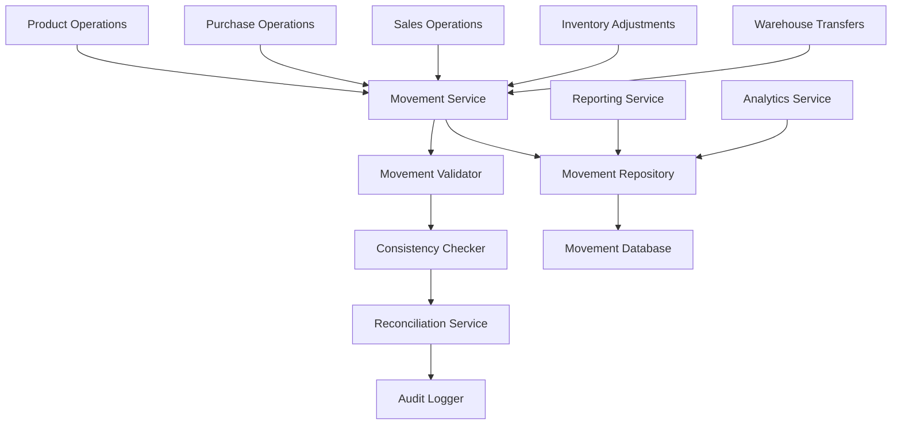
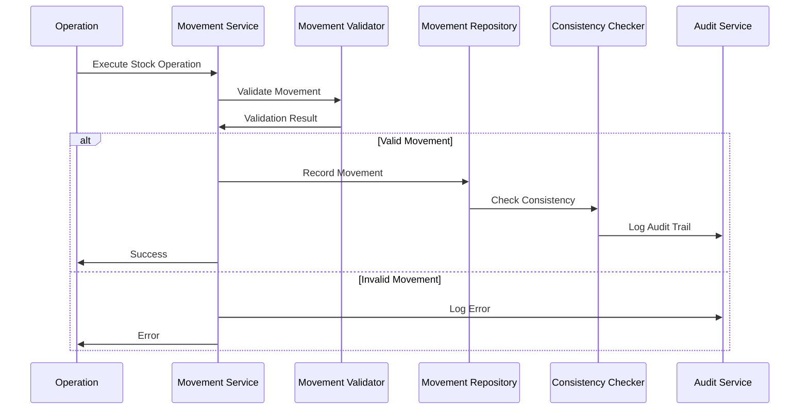

# Design Document

## Overview

Este documento describe el diseño técnico para implementar un sistema completo de movimientos de inventario en TiendaFácil. El sistema registrará automáticamente todos los cambios de stock, mantendrá trazabilidad completa y proporcionará herramientas de validación y reconciliación.

## Architecture

### System Architecture



### Data Flow



## Components and Interfaces

### 1. Movement Model

```typescript
interface InventoryMovement {
  id: string;
  productId: string;
  warehouseId: string;
  movementType: MovementType;
  quantity: number;
  unitCost?: number;
  totalValue?: number;
  referenceType: ReferenceType;
  referenceId: string;
  batchId?: string;
  previousStock: number;
  newStock: number;
  userId: string;
  notes?: string;
  createdAt: Date;
  storeId: string;
}

enum MovementType {
  INITIAL_STOCK = 'initial_stock',
  PURCHASE = 'purchase',
  SALE = 'sale',
  ADJUSTMENT = 'adjustment',
  TRANSFER_OUT = 'transfer_out',
  TRANSFER_IN = 'transfer_in',
  RETURN = 'return',
  DAMAGE = 'damage',
  EXPIRY = 'expiry'
}

enum ReferenceType {
  PRODUCT_CREATION = 'product_creation',
  PURCHASE_ORDER = 'purchase_order',
  SALE_TRANSACTION = 'sale_transaction',
  MANUAL_ADJUSTMENT = 'manual_adjustment',
  WAREHOUSE_TRANSFER = 'warehouse_transfer',
  CUSTOMER_RETURN = 'customer_return',
  SUPPLIER_RETURN = 'supplier_return'
}
```

### 2. Movement Service

```typescript
interface MovementService {
  recordMovement(movement: CreateMovementRequest): Promise<InventoryMovement>;
  recordBatchMovements(movements: CreateMovementRequest[]): Promise<InventoryMovement[]>;
  getProductMovements(productId: string, filters?: MovementFilters): Promise<InventoryMovement[]>;
  getMovementsByReference(referenceType: ReferenceType, referenceId: string): Promise<InventoryMovement[]>;
  calculateStockAtDate(productId: string, warehouseId: string, date: Date): Promise<number>;
  validateMovement(movement: CreateMovementRequest): Promise<ValidationResult>;
}

interface CreateMovementRequest {
  productId: string;
  warehouseId: string;
  movementType: MovementType;
  quantity: number;
  unitCost?: number;
  referenceType: ReferenceType;
  referenceId: string;
  batchId?: string;
  userId: string;
  notes?: string;
}

interface MovementFilters {
  dateFrom?: Date;
  dateTo?: Date;
  movementTypes?: MovementType[];
  warehouseId?: string;
  userId?: string;
  batchId?: string;
}
```

### 3. Consistency Validator

```typescript
interface ConsistencyValidator {
  validateProductStock(productId: string, warehouseId: string): Promise<ConsistencyResult>;
  validateAllProducts(warehouseId?: string): Promise<ConsistencyReport>;
  reconcileProduct(productId: string, warehouseId: string): Promise<ReconciliationResult>;
  generateReconciliationReport(): Promise<ReconciliationReport>;
}

interface ConsistencyResult {
  productId: string;
  warehouseId: string;
  currentStock: number;
  calculatedStock: number;
  discrepancy: number;
  isConsistent: boolean;
  lastMovementDate: Date;
}

interface ReconciliationResult {
  productId: string;
  warehouseId: string;
  adjustmentMovement?: InventoryMovement;
  correctedStock: number;
  reason: string;
}
```

### 4. Integration Points

#### Product Creation Integration
```typescript
// En ProductService
async createProduct(productData: CreateProductRequest): Promise<Product> {
  const product = await this.productRepository.create(productData);
  
  // Registrar movimiento inicial si tiene stock inicial
  if (productData.initialStock > 0) {
    await this.movementService.recordMovement({
      productId: product.id,
      warehouseId: productData.warehouseId,
      movementType: MovementType.INITIAL_STOCK,
      quantity: productData.initialStock,
      unitCost: productData.cost,
      referenceType: ReferenceType.PRODUCT_CREATION,
      referenceId: product.id,
      userId: productData.userId
    });
  }
  
  return product;
}
```

#### Purchase Integration
```typescript
// En PurchaseService
async processPurchase(purchaseData: ProcessPurchaseRequest): Promise<Purchase> {
  const purchase = await this.purchaseRepository.create(purchaseData);
  
  // Registrar movimientos para cada producto
  const movements = purchaseData.items.map(item => ({
    productId: item.productId,
    warehouseId: purchaseData.warehouseId,
    movementType: MovementType.PURCHASE,
    quantity: item.quantity,
    unitCost: item.unitCost,
    referenceType: ReferenceType.PURCHASE_ORDER,
    referenceId: purchase.id,
    userId: purchaseData.userId
  }));
  
  await this.movementService.recordBatchMovements(movements);
  
  return purchase;
}
```

#### Sales Integration
```typescript
// En SalesService
async processSale(saleData: ProcessSaleRequest): Promise<Sale> {
  const sale = await this.salesRepository.create(saleData);
  
  // Registrar movimientos de salida para cada producto
  const movements = saleData.items.map(item => ({
    productId: item.productId,
    warehouseId: saleData.warehouseId,
    movementType: MovementType.SALE,
    quantity: -item.quantity, // Negativo para salida
    unitCost: item.unitCost,
    referenceType: ReferenceType.SALE_TRANSACTION,
    referenceId: sale.id,
    userId: saleData.userId
  }));
  
  await this.movementService.recordBatchMovements(movements);
  
  return sale;
}
```

## Data Models

### Database Schema

```sql
-- Tabla de movimientos de inventario
CREATE TABLE inventory_movements (
  id VARCHAR(255) PRIMARY KEY,
  product_id VARCHAR(255) NOT NULL,
  warehouse_id VARCHAR(255) NOT NULL,
  movement_type ENUM('initial_stock', 'purchase', 'sale', 'adjustment', 'transfer_out', 'transfer_in', 'return', 'damage', 'expiry') NOT NULL,
  quantity DECIMAL(10,3) NOT NULL,
  unit_cost DECIMAL(10,2),
  total_value DECIMAL(12,2),
  reference_type ENUM('product_creation', 'purchase_order', 'sale_transaction', 'manual_adjustment', 'warehouse_transfer', 'customer_return', 'supplier_return') NOT NULL,
  reference_id VARCHAR(255) NOT NULL,
  batch_id VARCHAR(255),
  previous_stock DECIMAL(10,3) NOT NULL,
  new_stock DECIMAL(10,3) NOT NULL,
  user_id VARCHAR(255) NOT NULL,
  notes TEXT,
  created_at TIMESTAMP DEFAULT CURRENT_TIMESTAMP,
  store_id VARCHAR(255) NOT NULL,
  
  INDEX idx_product_warehouse (product_id, warehouse_id),
  INDEX idx_reference (reference_type, reference_id),
  INDEX idx_batch (batch_id),
  INDEX idx_created_at (created_at),
  INDEX idx_store (store_id)
);

-- Tabla de consistencia de inventario (cache)
CREATE TABLE inventory_consistency (
  id VARCHAR(255) PRIMARY KEY,
  product_id VARCHAR(255) NOT NULL,
  warehouse_id VARCHAR(255) NOT NULL,
  current_stock DECIMAL(10,3) NOT NULL,
  calculated_stock DECIMAL(10,3) NOT NULL,
  discrepancy DECIMAL(10,3) NOT NULL,
  last_check_at TIMESTAMP DEFAULT CURRENT_TIMESTAMP,
  last_movement_at TIMESTAMP,
  store_id VARCHAR(255) NOT NULL,
  
  UNIQUE KEY unique_product_warehouse (product_id, warehouse_id, store_id),
  INDEX idx_discrepancy (discrepancy),
  INDEX idx_last_check (last_check_at)
);
```

### MongoDB Schema (Current System)

```typescript
// Modelo Mongoose para movimientos
const InventoryMovementSchema = new Schema({
  productId: { type: String, required: true },
  warehouseId: { type: String, required: true },
  movementType: { 
    type: String, 
    enum: ['initial_stock', 'purchase', 'sale', 'adjustment', 'transfer_out', 'transfer_in', 'return', 'damage', 'expiry'],
    required: true 
  },
  quantity: { type: Number, required: true },
  unitCost: { type: Number },
  totalValue: { type: Number },
  referenceType: { 
    type: String,
    enum: ['product_creation', 'purchase_order', 'sale_transaction', 'manual_adjustment', 'warehouse_transfer', 'customer_return', 'supplier_return'],
    required: true 
  },
  referenceId: { type: String, required: true },
  batchId: { type: String },
  previousStock: { type: Number, required: true },
  newStock: { type: Number, required: true },
  userId: { type: String, required: true },
  notes: { type: String },
  storeId: { type: String, required: true }
}, { 
  timestamps: true,
  collection: 'inventory_movements'
});

// Índices para optimización
InventoryMovementSchema.index({ productId: 1, warehouseId: 1 });
InventoryMovementSchema.index({ referenceType: 1, referenceId: 1 });
InventoryMovementSchema.index({ batchId: 1 });
InventoryMovementSchema.index({ createdAt: -1 });
InventoryMovementSchema.index({ storeId: 1 });
```

## Error Handling

### Movement Validation Errors
- **INSUFFICIENT_STOCK**: Cuando se intenta una salida mayor al stock disponible
- **INVALID_QUANTITY**: Cuando la cantidad es cero o inválida
- **MISSING_REFERENCE**: Cuando falta la referencia del movimiento
- **DUPLICATE_MOVEMENT**: Cuando se intenta registrar el mismo movimiento dos veces
- **WAREHOUSE_NOT_FOUND**: Cuando el almacén no existe

### Consistency Errors
- **STOCK_MISMATCH**: Cuando el stock calculado no coincide con el registrado
- **NEGATIVE_STOCK**: Cuando el stock calculado es negativo
- **MISSING_MOVEMENTS**: Cuando faltan movimientos para explicar el stock actual

### Recovery Strategies
- **Automatic Reconciliation**: Para discrepancias menores
- **Manual Review**: Para discrepancias mayores
- **Rollback Transactions**: Para errores en operaciones por lotes

## Testing Strategy

### Unit Tests
- Validación de movimientos individuales
- Cálculo de stock por fecha
- Detección de inconsistencias
- Operaciones por lotes

### Integration Tests
- Integración con creación de productos
- Integración con compras y ventas
- Transferencias entre almacenes
- Reconciliación automática

### Performance Tests
- Consultas de historial con grandes volúmenes
- Operaciones por lotes masivas
- Cálculos de consistencia
- Generación de reportes

## Security Considerations

### Access Control
- Solo usuarios autorizados pueden registrar movimientos
- Auditoría completa de todos los cambios
- Separación de permisos por tipo de movimiento

### Data Integrity
- Validación de integridad referencial
- Prevención de modificación de movimientos históricos
- Backup automático antes de reconciliaciones

## Performance Considerations

### Optimization Strategies
- Índices optimizados para consultas frecuentes
- Cache de stock actual por producto/almacén
- Paginación para consultas de historial
- Agregaciones pre-calculadas para reportes

### Scalability
- Particionamiento por fecha para movimientos históricos
- Archivado de movimientos antiguos
- Procesamiento asíncrono para operaciones masivas